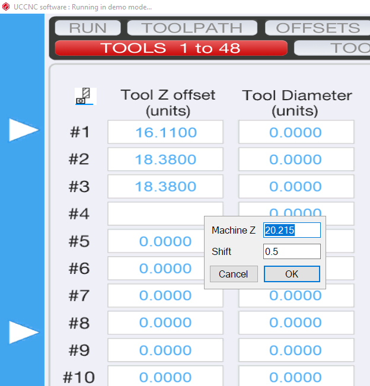

# MachineZToolSet

MachineZToolSet is a plugin for UCCNC Motion Control Software that allows you to easily set the current Machine Z position into the Tool Z Offset table.

## WARNING:

The author holds no responsibility for any damage, injury or harm caused by use or misuse of this software product.
This software may or may not have been tested. Use it at your own risk.
Software is shipped AS-IS

## How to Use:

Just click on any Tool Z Offset field and a popup shows up with the current Machine Z position.

Click OK and the result will be written into the field.

*Machine Z* is ediatable, so you can also enter your own value.

*Shift* is added to the Machine Z value.



## Installation

Grab the latest copy of the MachineZToolSet.dll here:
[Releases](https://github.com/swindex/UCCNCMachineZToolSet/releases/)
... drop it into ```C:\UCCNC\Plugins``` directory and enable it/check for startup in UCCNC Plugin config

## License

License Type: MIT

Created by: Eldar Gerfanov

## Contributing

Yes, it is in god-awful Visual Basic .net which no self-respecting software developer wants to use.
So. Pull requests are welcome!
